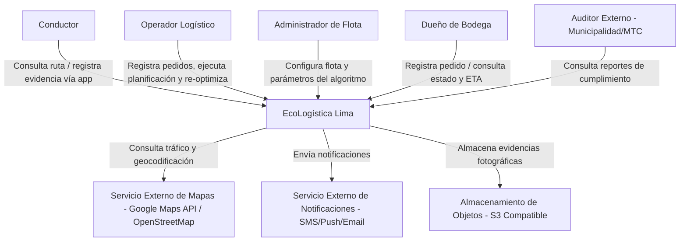
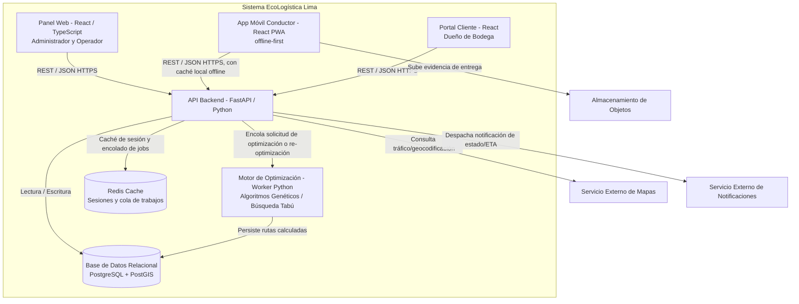
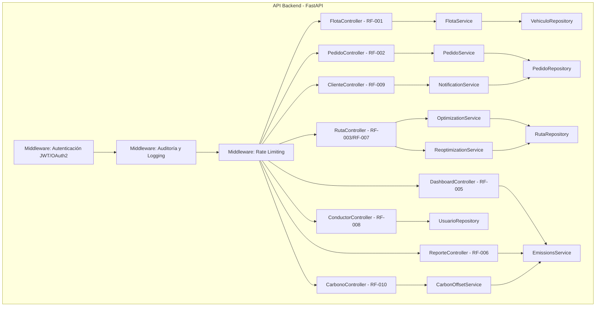

# Arquitectura de Software - Modelo C4

## Metadatos
- **Nombre del Proyecto:** EcoLogística Lima - Optimizador de Rutas Sostenibles
- **Integrantes:**
  - Fernandez Condor Jhon Smith
  - Perez Ordoñez Anthony Alexis
  - Tovar Arias Michael Aldo
- **Fecha:** 01 de septiembre de 2026 (actualizado el 05 de octubre de 2026)
- **Versión:** 1.1.0

---

## Nivel 1: Diagrama de Contexto

## Nivel 2: Diagrama de Contenedores

## Nivel 3: Diagrama de Componentes (API Backend)

Estructuración interna de los módulos que componen el contenedor de la API (Controladores, Servicios, Repositorios, Middleware de Seguridad), alineada 1 a 1 con los requisitos funcionales del Documento 06:

---

## Estado de implementación al 05/10/2026 (Sprints 1 y 2)

| Contenedor / componente | Estado | Observación |
|---|---|---|
| Panel web (React) | Parcial | Inicio de sesión, inicio, vehículos y pedidos |
| App móvil del conductor (PWA) y portal del cliente | No implementados | RF-004, RF-008 y RF-009 |
| API backend (FastAPI) | Parcial | Autenticación, vehículos y pedidos |
| Motor de optimización | No implementado | Pendiente del spike EN-001 (RSK-05) |
| Base de datos | Parcial | SQLite en desarrollo; PostgreSQL/PostGIS pendiente (ver Documento 11, sección 4) |
| Redis | No implementado | Depende del motor (EN-009) |
| Servicios externos (mapas, notificaciones, almacenamiento) | No implementados | Corresponden a EP-04 y EP-02 |

**Desviación a nivel de componentes:** el backend se organizó en `routers`, `schemas`, `models` y `auth`; los routers acceden directamente al ORM, sin las capas de servicios y repositorios del diagrama del nivel 3. Es una simplificación aceptable mientras hay solo tres módulos; debe revisarse al incorporar el motor de optimización para no acoplar la lógica de dominio a los endpoints.

## Historial de Control de Cambios

| Versión | Fecha | Cambio |
|---|---|---|
| 1.0.0 | 01/09/2026 | Creación del documento: C4 niveles 1, 2 y 3. |
| 1.1.0 | 05/10/2026 | Se agrega el estado de implementación por contenedor y la desviación en la organización de componentes del backend; los diagramas no cambian. |
