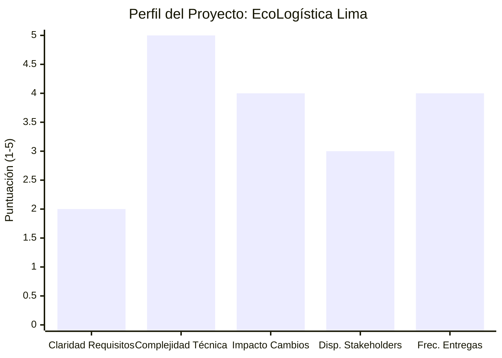

# Selección del Enfoque del Proyecto

## 1. Encabezado de Metadatos

| Campo | Detalle |
|---|---|
| **Nombre del Proyecto** | EcoLogística Lima – Optimizador de Rutas Sostenibles para DistriRápido S.A.C. |
| **Integrantes** | Fernandez Condor Jhon Smith - Perez Ordoñez Anthony Alexis - Tovar Arias Michael Aldo
| **Curso** | Taller de Proyectos 2 |
| **Fecha** | 25/08/2026 |
| **Versión** | 1.0.0 |
| **Estado** | Aprobado para inicio de proyecto |

---

## 2. Matriz de Ponderación de Variables

Cada variable se evalúa en una escala de **1 (bajo)** a **5 (alto)**. Puntuaciones altas en la mayoría de variables orientan hacia un enfoque **Ágil**; puntuaciones bajas orientan hacia un enfoque **Predictivo**. Puntuaciones mixtas orientan hacia un enfoque **Híbrido**.

| N° | Variable | Puntuación (1-5) | Justificación |
|---|---|---|---|
| 1 | Claridad y estabilidad de requisitos | 2 | Los RF y RNF macro están definidos en la consigna, pero el detalle de las reglas de negocio (parámetros del algoritmo, ponderación de la función objetivo, reglas de restricción vehicular, zonas de riesgo) se irán descubriendo y ajustando durante el desarrollo, especialmente tras el trabajo de campo en Lima. |
| 2 | Complejidad técnica e innovación | 5 | El núcleo del proyecto es un problema NP-difícil (VRPTW + Green VRP) que requiere experimentación iterativa con metaheurísticas (GA, ACO, Tabú), integración de datos geoespaciales y de tráfico en tiempo real. Alta incertidumbre técnica. |
| 3 | Severidad del impacto ante cambios | 4 | Un cambio en la función objetivo, en las restricciones normativas (ej. pico y placa) o en la fuente de datos de tráfico puede impactar directamente el núcleo algorítmico y la arquitectura de datos. El costo de "descubrir tarde" es alto. |
| 4 | Disponibilidad de los interesados (stakeholders) | 3 | El docente (Product Owner académico) y el "cliente ficticio" (DistriRápido S.A.C.) tienen disponibilidad moderada, con retroalimentación programada al cierre de cada iteración (revisiones cada 3-4 semanas), no de forma continua/diaria. |
| 5 | Frecuencia de entregas de valor | 4 | El cronograma sugerido exige 4 entregables incrementales y funcionales (semanas 3, 7, 11, 14), cada uno con valor demostrable (mockups → MVP básico → dashboard/mapa → optimización avanzada). |

**Puntuación promedio ponderada: 3.6 / 5** → Perfil inclinado hacia lo adaptativo, pero con elementos de planificación fuerte (presupuesto fijo, alcance normativo, entregables documentales obligatorios) que impiden un enfoque 100% ágil.

---

## 3. Diagrama de Radar del Enfoque

### 3.1 Representación visual (equivalente de barras, Mermaid)

Mermaid no soporta de forma nativa un gráfico de radar; se presenta una visualización de barras equivalente (`xychart-beta`) que refleja el mismo perfil de puntuaciones, complementada por la tabla descriptiva detallada de la sección 3.2.

### 3.2 Tabla descriptiva detallada

| Variable | Bajo (1-2) | Medio (3) | Alto (4-5) | Posición del proyecto |
|---|---|---|---|---|
| Claridad y estabilidad de requisitos | ⬤ (2) | | | Predictivo |
| Complejidad técnica e innovación | | | ⬤ (5) | Ágil |
| Severidad del impacto ante cambios | | | ⬤ (4) | Predictivo (mitigar con planificación) |
| Disponibilidad de stakeholders | | ⬤ (3) | | Híbrido |
| Frecuencia de entregas de valor | | | ⬤ (4) | Ágil |

**Lectura del perfil:** el proyecto combina baja estabilidad de requisitos de detalle y alta necesidad de entregas incrementales de valor (fuerzas ágiles), con alta severidad ante cambios no controlados y restricciones normativas/presupuestales fijas propias de un contexto académico evaluado (fuerzas predictivas).

---

## 4. Decisión y Justificación del Enfoque

### Enfoque Seleccionado: **HÍBRIDO** (Predictivo + Ágil)

De acuerdo con el **PMBOK 7ª Edición**, la selección del enfoque de desarrollo y ciclo de vida debe adaptarse ("tailoring") a las características del proyecto, y no responder a un dogma metodológico. La guía PMBOK 7 recomienda un enfoque híbrido cuando coexisten: (a) partes del proyecto con alcance estable y regulado, y (b) partes con alta incertidumbre técnica que requieren aprendizaje y adaptación continua — exactamente el perfil resultante de la matriz de ponderación.

**Justificación alineada a los principios y dominios de desempeño de PMBOK 7:**

1. **Dominio de Planificación (Planning Performance Domain):** Los componentes de alcance fijo — presupuesto (S/ 500,000), normativa peruana (Ley 29733, Ley 30224, D.S. 033-2012-MTC), estándares obligatorios (OWASP, WCAG, ISO 14083) y entregables documentales de curso — requieren una planificación predictiva inicial robusta: cronograma de hitos, EDT/WBS y línea base de alcance definida desde el Acta de Constitución.

2. **Dominio de Incertidumbre (Uncertainty Performance Domain) y Principio de "Navegar la Complejidad":** El núcleo algorítmico (VRPTW + Green VRP con metaheurísticas) es de naturaleza exploratoria: no se puede predecir de antemano qué metaheurística (GA, ACO, Tabú) rendirá mejor bajo el límite de 45 segundos del RNF-01. Esto exige **sprints cortos, prototipado incremental y retroalimentación constante**, propios del enfoque ágil (Scrum/iterativo-incremental).

3. **Dominio de Entrega de Valor (Delivery Performance Domain) y Principio de "Enfocarse en el Valor":** El cronograma sugerido de 4 iteraciones con entregables funcionales progresivos (mockups → CRUD + algoritmo básico → visualización + dashboard → optimización avanzada) refleja exactamente un ciclo de vida incremental, donde cada iteración libera valor demostrable e inspeccionable por el docente/cliente.

4. **Principio de "Adaptabilidad y Resiliencia":** Ante hallazgos del trabajo de campo (ej. direcciones sin nomenclatura estándar en SJL, disponibilidad real de APIs de tráfico), el equipo necesita reajustar el backlog de requisitos sin renegociar todo el proyecto, lo cual valida el componente ágil.

5. **Principio de "Interesados" (Stakeholder Engagement):** Dado que la disponibilidad de los interesados es moderada (revisión al cierre de cada iteración y no diaria), se opta por un marco ágil **adaptado** (revisiones/demos al final de cada iteración de 3-4 semanas) en lugar de Scrum puro con sprints diarios y Product Owner permanente.

### Modelo de aplicación híbrida propuesto

| Componente del proyecto | Enfoque aplicado |
|---|---|
| Gestión de alcance macro, presupuesto, cronograma de hitos, cumplimiento normativo y documental | **Predictivo** (fase de Inicio y Planificación tipo cascada) |
| Diseño de arquitectura, base de datos, mockups UI | **Predictivo** con validación temprana |
| Desarrollo del algoritmo de optimización (VRPTW/Green VRP), integración de mapas/tráfico, dashboard | **Ágil** (iteraciones de 3-4 semanas tipo Scrum, con backlog priorizado, demo e inspección al cierre de cada iteración) |
| Pruebas de aceptación y cierre | **Predictivo** (plan de pruebas formal, checklist de aceptación) |

**Conclusión:** Se adopta un **ciclo de vida híbrido predominantemente incremental**, con una capa predictiva para el gobierno del proyecto (alcance, costo, cronograma, cumplimiento normativo) y una capa ágil-iterativa para el desarrollo técnico de alto riesgo e incertidumbre (algoritmo de optimización y componentes de integración de datos en tiempo real).
