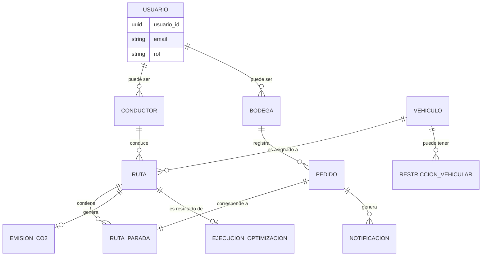

# Diseño e Ingeniería de Base de Datos

## Metadatos
- **Nombre del Proyecto:** EcoLogística Lima - Optimizador de Rutas Sostenibles
- **Integrantes:**
  - Fernandez Condor Jhon Smith
  - Perez Ordoñez Anthony Alexis
  - Tovar Arias Michael Aldo
- **Fecha:** 01 de septiembre de 2026
- **Versión:** 1.0.0

---

## 1. Modelo Conceptual (Diagrama Entidad-Relación)



## 2. Modelo Lógico

| Entidad | Atributos principales | PK | FK | Notas de normalización |
|---|---|---|---|---|
| `usuarios` | usuario_id, nombre, email, password_hash, rol, estado, creado_en | usuario_id | — | 3FN: el rol es un valor atómico, sin grupos repetitivos |
| `conductores` | conductor_id, usuario_id, licencia, telefono | conductor_id | usuario_id → usuarios | Separado de `usuarios` para no mezclar atributos exclusivos de conductor con los de cualquier usuario (RF-008) |
| `bodegas` | bodega_id, usuario_id, razon_social, direccion_referencial, ubicacion (geo) | bodega_id | usuario_id → usuarios | Idem; evita nulos masivos en `usuarios`; soporta el aislamiento por `bodega_id` (RN-010) |
| `vehiculos` | vehiculo_id, placa, capacidad_kg, tipo_combustible, factor_emision_co2, estado | vehiculo_id | — | Placa con restricción UNIQUE (RF-001) |
| `restricciones_vehiculares` | restriccion_id, vehiculo_id, dia_restringido, exonerado, motivo_exoneracion | restriccion_id | vehiculo_id → vehiculos | Modela Pico y Placa (RN-002) sin duplicar atributos en `vehiculos` |
| `pedidos` | pedido_id, bodega_id, direccion, ubicacion (geo), peso_kg, ventana_inicio, ventana_fin, estado, creado_en | pedido_id | bodega_id → bodegas | Cada pedido pertenece a una única bodega (dependencia funcional completa); soporta RF-002 |
| `rutas` | ruta_id, vehiculo_id, conductor_id, fecha, estado, distancia_km_total, distancia_base_km | ruta_id | vehiculo_id → vehiculos, conductor_id → conductores | `distancia_base_km` (sin optimizar) se conserva para calcular el CO₂ evitado de RF-010 |
| `ruta_paradas` | parada_id, ruta_id, pedido_id, orden_secuencia, hora_estimada, hora_real, evidencia_url | parada_id | ruta_id → rutas, pedido_id → pedidos | Tabla de asociación N:M resuelta con atributos propios (orden, evidencia); soporta RF-008 |
| `ejecuciones_optimizacion` | ejecucion_id, ruta_id, algoritmo_usado, tiempo_computo_ms, distancia_optimizada_km, es_reoptimizacion | ejecucion_id | ruta_id → rutas | Auditoría de RNF-001 (tiempo ≤ 45 s) y de las corridas de RF-007 (re-optimización) |
| `emisiones_co2` | emision_id, ruta_id, kg_co2_emitido, kg_co2_evitado, arboles_equivalentes, metodologia_calculo | emision_id | ruta_id → rutas | Soporta RF-010 (Compensación de Carbono) y RN-006/RN-009 |
| `notificaciones` | notificacion_id, pedido_id, canal, mensaje, enviado_en | notificacion_id | pedido_id → pedidos | Soporta RF-009 (Notificaciones a Clientes) |

Todas las tablas cumplen **Tercera Forma Normal (3FN):** cada atributo no clave depende únicamente de la clave primaria completa, sin dependencias transitivas (ej. `distancia_km_total` de `rutas` no se deriva de `vehiculo_id`, sino que es propia de la ejecución de esa ruta).

## 3. Modelo Físico (DDL SQL)

```sql
CREATE EXTENSION IF NOT EXISTS "pgcrypto";
CREATE EXTENSION IF NOT EXISTS postgis;

CREATE TABLE usuarios (
    usuario_id UUID PRIMARY KEY DEFAULT gen_random_uuid(),
    nombre VARCHAR(150) NOT NULL,
    email VARCHAR(255) NOT NULL UNIQUE,
    password_hash VARCHAR(255) NOT NULL,
    rol VARCHAR(30) NOT NULL CHECK (rol IN ('ADMIN_FLOTA','OPERADOR','CONDUCTOR','BODEGA','AUDITOR')),
    estado VARCHAR(20) NOT NULL DEFAULT 'ACTIVO',
    creado_en TIMESTAMP WITH TIME ZONE DEFAULT CURRENT_TIMESTAMP
);
CREATE INDEX idx_usuarios_email ON usuarios(email);

CREATE TABLE conductores (
    conductor_id UUID PRIMARY KEY DEFAULT gen_random_uuid(),
    usuario_id UUID NOT NULL REFERENCES usuarios(usuario_id),
    licencia VARCHAR(20) NOT NULL UNIQUE,
    telefono VARCHAR(20)
);

CREATE TABLE bodegas (
    bodega_id UUID PRIMARY KEY DEFAULT gen_random_uuid(),
    usuario_id UUID NOT NULL REFERENCES usuarios(usuario_id),
    razon_social VARCHAR(200) NOT NULL,
    direccion_referencial TEXT NOT NULL,
    ubicacion GEOGRAPHY(POINT, 4326) NOT NULL
);

CREATE TABLE vehiculos (
    vehiculo_id UUID PRIMARY KEY DEFAULT gen_random_uuid(),
    placa VARCHAR(10) NOT NULL UNIQUE,
    capacidad_kg NUMERIC(8,2) NOT NULL CHECK (capacidad_kg > 0),
    tipo_combustible VARCHAR(20) NOT NULL CHECK (tipo_combustible IN ('GASOLINA','DIESEL','GLP','HIBRIDO','ELECTRICO')),
    factor_emision_co2 NUMERIC(10,4),
    estado VARCHAR(20) NOT NULL DEFAULT 'DISPONIBLE'
);

CREATE TABLE restricciones_vehiculares (
    restriccion_id UUID PRIMARY KEY DEFAULT gen_random_uuid(),
    vehiculo_id UUID NOT NULL REFERENCES vehiculos(vehiculo_id),
    dia_restringido SMALLINT NOT NULL CHECK (dia_restringido BETWEEN 1 AND 7),
    exonerado BOOLEAN NOT NULL DEFAULT FALSE,
    motivo_exoneracion TEXT
);

CREATE TABLE pedidos (
    pedido_id UUID PRIMARY KEY DEFAULT gen_random_uuid(),
    bodega_id UUID NOT NULL REFERENCES bodegas(bodega_id),
    direccion TEXT NOT NULL,
    ubicacion GEOGRAPHY(POINT, 4326) NOT NULL,
    peso_kg NUMERIC(8,2) NOT NULL CHECK (peso_kg > 0),
    ventana_inicio TIMESTAMP WITH TIME ZONE NOT NULL,
    ventana_fin TIMESTAMP WITH TIME ZONE NOT NULL,
    estado VARCHAR(30) NOT NULL DEFAULT 'PENDIENTE',
    creado_en TIMESTAMP WITH TIME ZONE DEFAULT CURRENT_TIMESTAMP,
    CHECK (ventana_fin > ventana_inicio)
);
CREATE INDEX idx_pedidos_estado ON pedidos(estado);
CREATE INDEX idx_pedidos_bodega ON pedidos(bodega_id);

CREATE TABLE rutas (
    ruta_id UUID PRIMARY KEY DEFAULT gen_random_uuid(),
    vehiculo_id UUID NOT NULL REFERENCES vehiculos(vehiculo_id),
    conductor_id UUID NOT NULL REFERENCES conductores(conductor_id),
    fecha DATE NOT NULL,
    estado VARCHAR(20) NOT NULL DEFAULT 'PLANIFICADA',
    distancia_km_total NUMERIC(10,2),
    distancia_base_km NUMERIC(10,2)
);
CREATE INDEX idx_rutas_fecha ON rutas(fecha);

CREATE TABLE ruta_paradas (
    parada_id UUID PRIMARY KEY DEFAULT gen_random_uuid(),
    ruta_id UUID NOT NULL REFERENCES rutas(ruta_id) ON DELETE CASCADE,
    pedido_id UUID NOT NULL REFERENCES pedidos(pedido_id),
    orden_secuencia SMALLINT NOT NULL,
    hora_estimada TIMESTAMP WITH TIME ZONE,
    hora_real TIMESTAMP WITH TIME ZONE,
    evidencia_url TEXT,
    UNIQUE (ruta_id, orden_secuencia)
);

CREATE TABLE ejecuciones_optimizacion (
    ejecucion_id UUID PRIMARY KEY DEFAULT gen_random_uuid(),
    ruta_id UUID NOT NULL REFERENCES rutas(ruta_id),
    algoritmo_usado VARCHAR(30) NOT NULL,
    tiempo_computo_ms INTEGER NOT NULL CHECK (tiempo_computo_ms <= 45000),
    distancia_optimizada_km NUMERIC(10,2),
    es_reoptimizacion BOOLEAN NOT NULL DEFAULT FALSE
);

CREATE TABLE emisiones_co2 (
    emision_id UUID PRIMARY KEY DEFAULT gen_random_uuid(),
    ruta_id UUID NOT NULL REFERENCES rutas(ruta_id),
    kg_co2_emitido NUMERIC(10,4) NOT NULL,
    kg_co2_evitado NUMERIC(10,4),
    arboles_equivalentes NUMERIC(10,2),
    metodologia_calculo VARCHAR(30) NOT NULL DEFAULT 'GLEC_ISO14083'
);

CREATE TABLE notificaciones (
    notificacion_id UUID PRIMARY KEY DEFAULT gen_random_uuid(),
    pedido_id UUID NOT NULL REFERENCES pedidos(pedido_id),
    canal VARCHAR(20) NOT NULL CHECK (canal IN ('SMS','PUSH','EMAIL')),
    mensaje TEXT NOT NULL,
    enviado_en TIMESTAMP WITH TIME ZONE DEFAULT CURRENT_TIMESTAMP
);
```
