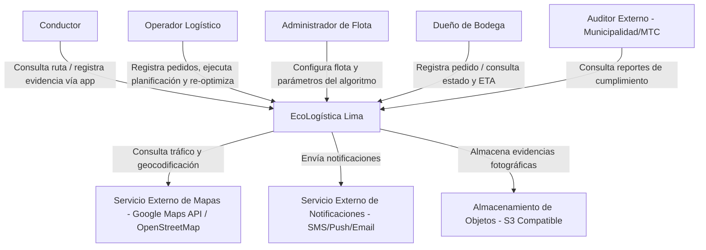
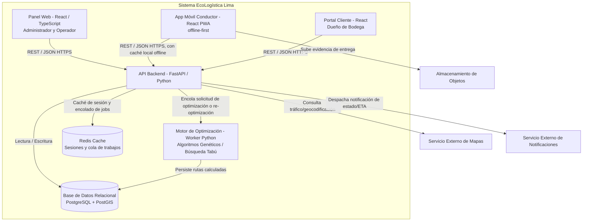
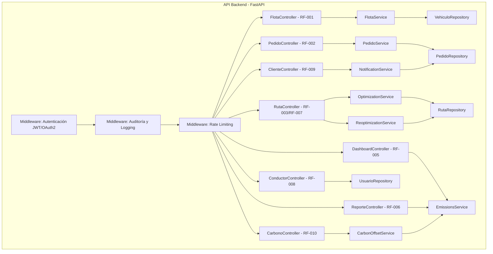

# Arquitectura de Software - Modelo C4

## Metadatos
- **Nombre del Proyecto:** EcoLogística Lima - Optimizador de Rutas Sostenibles
- **Integrantes:**
  - Fernandez Condor Jhon Smith
  - Perez Ordoñez Anthony Alexis
  - Tovar Arias Michael Aldo
- **Fecha:** 01 de septiembre de 2026
- **Versión:** 1.0.0

---

## Nivel 1: Diagrama de Contexto

## Nivel 2: Diagrama de Contenedores

## Nivel 3: Diagrama de Componentes (API Backend)

Estructuración interna de los módulos que componen el contenedor de la API (Controladores, Servicios, Repositorios, Middleware de Seguridad), alineada 1 a 1 con los requisitos funcionales del Documento 06:

